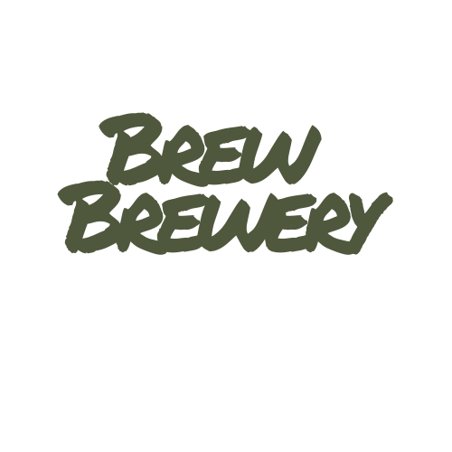
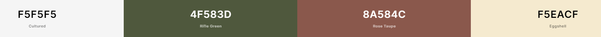

<h2 align=center id="top"></h2>

# **Table of Contents**

* [**Purpose**](#purpose)
* [**User Experience Design (UX)**](#user-experience-design)
  * [**User stories**](#user-stories)
  * [**Structure**](#structure)
  * [**Design**](#Design)
    * [**Colour Scheme**](#colour-scheme)
    * [**Typography**](#typography)
    * [**Frameworks**](#frameworks)
     * [**Icons**](#icons)
    * [**Wireframes**](#Wireframes)
- [**Features**](#Features)
    * [**Existing Features**](#Existing-Features)
    * [**Future Features**](#Features-Left-to-Implement)
* [**Technologies**](#Technologies)
* [**Testing**](#Testing)
    * [**Test Strategy**](#Test-Strategy)
      * [**Summary**](#Summary)
      * [**Responsive Testing**](#Responsive-Testing)
      * [**Validator Testing**](#Validator-Testing)
      * [**User Story Testing**](#User-Story-Testing)
      * [**Feature Testing**](#Feature-Testing)
* [**Deployment**](#Deployment)
    * [**GitHub Pages**](#Using-Github-Pages)
    * [**Locally**](Run-Locally)
* [**Credits**](#Credits)
  * [**Content and Media**](#Content-and-Media)
  * [**Acknowledgements**](#Acknowledgements)

 # **Brew Brewery**
## **Purpose**
I created this website to promote a fictious Brewery called **Brew Brewery** this website focuses on the backstory of the company, the products that Brew Brewery offer and also a way to get in contact with the company.

Not all craft beer is good beer and finding good craft beer can be hard nowadays with the craft brewing market being highly oversaturated.

**Brew Brewery** was created with this in mind to offer customers an insight into our brewing process while also being able to view the products we have on offer and where to buy them.

The live website can be found [here](https://paullally.github.io/Milestone-1/).

*** 
# **User Experience Design**

## **User Stories**

- As a user, I want to be able to navigate through the website easily so i that i know where to find the relevant information.
- As a user, I want to be able to see the products on offer so that I know what types of beer are available. 
-   As a user, I want to be able to read a description on of the products so that I can make a decision on what I would like to try. 
- As a user, I want a link that directs me to a site to buy these products so I don't have to search for this information myself. 
-    As a user, I want to be able view the website on all devices so I can show others the website on my mobile phone or laptop. 
-   As a user, I want to be able read about the company history to find out more about the company and its staff.
-   As a user, I want to be able read about the brewing process to learn about there unqiue brewing style. 
-   As a user, I want to be able know what the website is about from first glance to easily understand the main purpose of the site. 
-   As a user, I want to be able get in contact with the company so i can book in for a tour and give my feedback on the products they offer. 
-    As a user, I want to be able view their social media websites to get more frequent updates from the company.

## **Structure**
Every page contains a Navigation bar at the top of the webpage that will dissapear when you scroll down and reappear when you scroll up. it will direct them to new pages making it easy to navigate the website 
 This fufils the user story:
> As a user, I want to be able to navigate through the website easily so i that i know where to find the relevant information.

All pages  contain a Footer Element with links to the **Brew Brewery's** social media, a copyright disclaimer and a link to the **Drink Aware** website to promote safe and resposible drinking 
 This fufils the user story:
>As a user, I want to be able view there social media websites to get more frequent updates from the company.

All pages are fully responsive and the layouts will change dependant on screen size. To ensure that content and images are displayed properly and is readable on every device
 This fufils the user story:
> As a user, I want to be able view the website on all devices so I can show others the website on my mobile phone or laptop. 

The home page contains details on the backstory of **Brew Brewery**. The products they offer and the Brewing process they use.  
This fufils the user stories:
 
 > As a user, I want to be able read about the company history to find out more about the company and its staff. 
 > As a user, I want to be able read about the brewing process to learn about there unqiue brewing style.  
 > As a user, I want to be able know what the website is about from frist glance to easily understand the main purpose of the site.

 The products page contains images of the beer that is on offer, When you hover over the image an overlay will appear with the name of the beer and a learn more button. When this button is clicked you are given a description of the beer and a link to where to buy that beer.  
 This fufils the user stories:
  > As a user, I want to be able to see the products on offer so that I know what types of beer they have on offer. 
 > As a user, I want to be able to read a description on of the products so that I can make a decision on what I would like to try. 
 > As a user, I want a link that directs me to a site to buy these products so I don't have to search for this information myself. 

The contacts page contains a form that can be filled out by inputing you name email address and a message.  
This fufils the user story:
>  As a user, I want to be able get in contact with the company so i can book in for a tour and give my feedback on the products they offer. 

## **Design**
---

### **Colour Scheme**

<h2 align=center id="top"></h2>

### **Typography**

- [**Montserrat:**](https://fonts.google.com/specimen/Montserrat?query=mont)
    - The primary font across the website, using four different weights: 400, 500, 700.
    - Montserrat was used for the main heading tags and the footer text elements. 
    - Montserrat was chosen due to is readablity for all users.

- [**Source Sans Pro**](https://fonts.google.com/specimen/Source+Sans+Pro?preview.text_type=custom&query=sou)
    - The secondary font across the website.
    - Source Sans Pro was used for the Navigation bar Links and paragraphs in a font weight of 400.
    - Source Sans Pro was chosen for its readablity and compliments  Montserrat well.
- [**Permanent Marker**](https://fonts.google.com/specimen/Permanent+Marker?preview.text_type=custom&query=perm)
    - This font was used to created the logo text.
    - Permanent Marker was used on the navigation bar logo and the landing image logo.
    - This font was used due its distinct style and playfulness.  

### **Frameworks**
- [MDBoostrap](https://mdbootstrap.com/)
    - Taking the responsiveness of Bootstrap and the front-end UI of Materialize, MDBoostrap makes use of both of these. So all aspects of the site were clean and accessible for all users. 

- [JQuery](https://code.jquery.com/jquery/)
    - In order to minimalize the amount of Javascript used across the application, I chose to implement a lot of the JS functionality with JQuery.

### **Icons**
- [Font Awesome Icons](https://fontawesome.com/)
    - All the icons used across this website were taken from Font Awesome and styled to match the colour scheme.

### **Wireframes**

#### **Desktop**

[**Home page**](wireframes/homepage1.png)  
[**Products page**](wireframes/productspage1.png) 
[**About page**](wireframes/aboutpage1.png)

#### **Tablet**

[**Home page**](wireframes/homepage3.png)  
[**Products page**](wireframes/productspage3.png) 
[**About page**](wireframes/aboutpage3.png)

#### **Moblie**

[**Home page**](wireframes/homepage2.png)  
[**Products page**](wireframes/productspage2.png) 
[**About page**](wireframes/aboutpage2.png)

